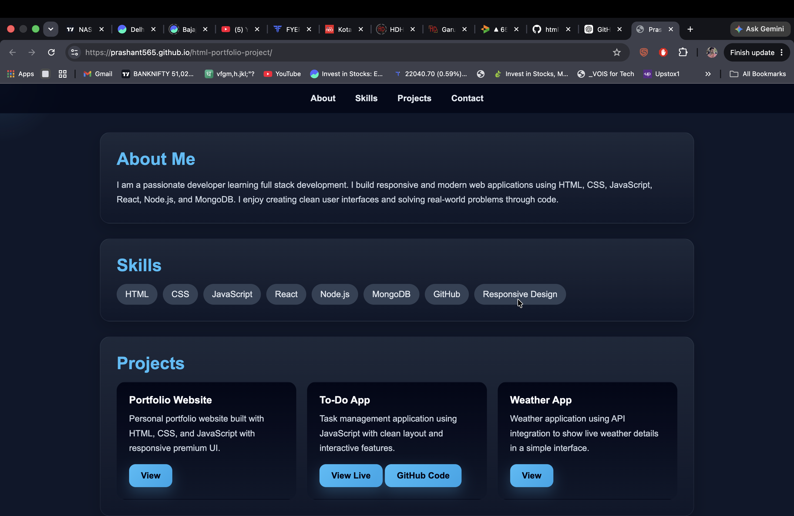

# 🌐 Personal Portfolio Website
<p align="center">
  
</p>
[](https://prashant565.github.io/html-portfolio-project/)


## 🚀 Live Demo

👉 **https://prashant565.github.io/html-portfolio-project/**

---

## 📖 About

This is my personal portfolio website built using **HTML** and **CSS**. It showcases my profile, skills, projects, resume, and contact information in a clean and responsive design.

---

## ✨ Features

- Responsive Design
- About Me
- Skills Section
- Projects Showcase
- Resume Download
- Contact Form

---

## 🛠️ Technologies Used

- HTML5
- CSS3

---

## 📂 Project Structure

```text
html-portfolio-project/
│── index.html
│── profile.jpg
│── resume.pdf
│── README.md
```

---

## 👨‍💻 Author

**Prashant Jha**

- GitHub: https://github.com/prashant565
- Portfolio: https://prashant565.github.io/html-portfolio-project/

---

⭐ If you like this project, please consider giving it a star.
